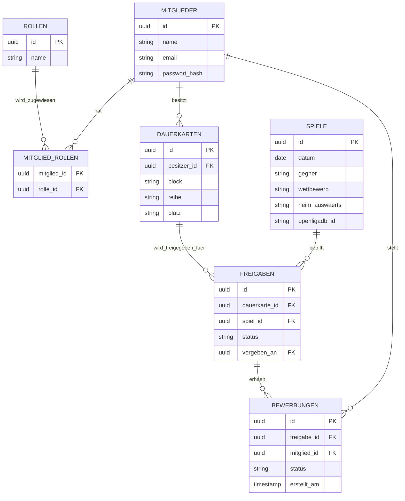

# Seefüchse-App – Projektdokumentation

> Verwaltungstool für Dauerkarten-Freigaben des SC Freiburg Fanclubs „die Seefüchse" – ersetzt die bisherige Excel-Verwaltung.

## Inhalt

- [Über das Projekt](#über-das-projekt)
- [Kernfunktion](#kernfunktion)
- [Tech-Stack](#tech-stack)
- [Datenbankstruktur](#datenbankstruktur)
- [Rollensystem](#rollensystem)
- [Seiten-Übersicht](#seiten-übersicht)
- [Projektstruktur](#projektstruktur)
- [Spielplan-Synchronisation](#spielplan-synchronisation)
- [Setup / Lokale Entwicklung](#setup--lokale-entwicklung)
- [Git-Konventionen](#git-konventionen)
- [Offene Punkte](#offene-punkte)

## Über das Projekt

Die Seefüchse sind ein Fanclub des SC Freiburg mit Sitz am Bodensee und rund 28 Mitgliedern. Der Club besitzt 12 Dauerkarten und 2 Fanclubkarten, die nicht bei jedem Spiel von allen Besitzern genutzt werden können. Bisher lief die Verwaltung freier Karten über Excel; die Seefüchse-App digitalisiert diesen Prozess vollständig, inklusive Spielplan, Kartenfreigabe und Bewerbung.

## Kernfunktion

Kann ein Dauerkarten-Besitzer ein Spiel nicht besuchen, gibt er seine Karte für dieses Spiel in der App frei. Alle Mitglieder sehen sofort, welche Karten für welches Spiel frei sind, und können sich darauf bewerben. Der Besitzer entscheidet manuell, wem er die Karte gibt – es gibt keine automatische Vergabe nach Reihenfolge oder Losverfahren. Benachrichtigungen laufen ausschließlich in-app, es ist kein E-Mail-Versand vorgesehen.

Ablauf in Kurzform: **Freigabe** durch DK-Besitzer → **Bewerbung** durch Mitglieder → **Entscheidung** durch DK-Besitzer → **Vergabe**.

## Tech-Stack

- Frontend: SvelteKit 5 (mit Runes: `$props`, `$state`, `$effect`)
- Datenbank: PostgreSQL über Supabase, Zugriff via Drizzle ORM
- Hosting: Netlify
- Icons: `@lucide/svelte` (Nachfolger von `lucide-svelte`, welches deprecated wurde)
- Karten: Leaflet.js
- Styling: Custom CSS, mobile-first ab 375px, Desktop begrenzt auf max. 720px
- Schriften: Inter (UI-Text) und JetBrains Mono (Zahlen/Daten)
- Entwicklung: VS Code, GitHub

Supabase wurde gegenüber Neon und MongoDB bevorzugt, weil Auth und Row Level Security bereits eingebaut sind und kein separates Auth-System nötig ist.

## Datenbankstruktur

Das vollständige ER-Diagramm liegt unter `DB-stucture/seefuechse_er_diagramm_V2.html`. Die zentralen Tabellen:



Die zentralen Tabellen:

- **mitglieder** – Stammdaten der Mitglieder (bei Supabase per FK an `auth.users`, kein eigenes Passwort-Feld)
- **rollen** – verfügbare Rollen (Admin, Vorstand, Mitglied)
- **mitglied_rollen** – Verknüpfungstabelle, da eine Person mehrere Rollen gleichzeitig haben kann
- **dauerkarten** – die 12 Dauerkarten + 2 Fanclubkarten, jeweils einem Besitzer zugeordnet
- **spiele** – Spielplan, inkl. `openligadb_id` für den automatischen Abgleich
- **freigaben** – verknüpft eine Dauerkarte mit einem Spiel sobald sie freigegeben wird, plus Status und ggf. `vergeben_an`
- **bewerbungen** – Bewerbungen von Mitgliedern auf eine Freigabe, inkl. Status

Wichtig: Der „DK-Besitzer" ist keine eigene Rolle, sondern ergibt sich aus der Zuordnung in `dauerkarten`.

## Rollensystem

Drei Rollen: Admin, Vorstand, Mitglied. Sie sind many-to-many über `mitglied_rollen` verknüpft, eine Person kann also z. B. gleichzeitig Vorstand und Mitglied sein. Vorstand hat den gleichen Funktionsumfang wie Admin, mit einer Ausnahme: die Seite „Rollen verwalten" ist ausschließlich Admins vorbehalten.

## Seiten-Übersicht

Mockups dazu liegen unter `mockups/`.

- **Start** – Dashboard mit Begrüßung, offenen Bewerbungen auf die eigene Karte (falls DK-Besitzer) und den nächsten Spielen
- **Spielplan** – alle Spiele der Saison, Filter nach Liga/Pokal/Europa, zeigt freie Karten je Spiel
- **Karte** – nur für DK-Besitzer: eigene Dauerkarte je Spiel freigeben/behalten, Bewerbungen einsehen und vergeben
- **Anfragen** – für Mitglieder ohne eigene Dauerkarte: eigene offene Bewerbungen und Verlauf
- **Verwaltung** – Übersicht aller Mitglieder, Dauerkarten-Zuordnung, Sync-Status mit OpenLigaDB
- **Verwaltung → Rollen verwalten** – nur Admin: Rollen den Mitgliedern zuweisen

## Projektstruktur

```
SEEFUECHSE/
├── DB-stucture/              # ER-Diagramme (Planungsstand)
├── mockups/                  # Visuelle Mockups der Seiten
├── src/
│   ├── routes/                # Start, spielplan/, karte/, verwaltung/(rollen/), anfragen/
│   ├── lib/
│   │   ├── server/db/         # Drizzle-Schema + DB-Client
│   │   └── components/        # (noch leer)
│   ├── app.css                # Design-Tokens
│   ├── app.html
│   └── app.d.ts
├── static/
├── drizzle.config.ts
├── svelte.config.js
├── vite.config.js
├── package.json
└── .env.example
```

## Spielplan-Synchronisation

Spielplan und Ergebnisse werden automatisch über die OpenLigaDB-API synchronisiert statt per Webscraping, um den Admin-Aufwand gering zu halten. OpenLigaDB deckt Bundesliga, 2. Bundesliga, 3. Liga und DFB-Pokal ab (`bl1`/`bl2`/`bl3`/`dfb`). Die Europa League wird dort nicht abgebildet – dafür ist noch eine manuelle Pflege oder eine separate Lösung nötig (siehe offene Punkte).

## Setup / Lokale Entwicklung

1. Node.js (LTS, mind. v20) muss installiert sein.
2. `npm install`
3. `.env.example` zu `.env` kopieren und mit den echten Supabase-Zugangsdaten füllen.
4. `npm run dev` startet den Dev-Server unter `http://localhost:5173`.

## Git-Konventionen

Commits folgen der Konvention `feat:` / `docs:` / `fix:` (z. B. `feat: Drizzle-Schema aus ER-Diagramm umgesetzt`).

## Offene Punkte

- Europa-League-Spiele: manuelle Pflege oder alternative Datenquelle, da OpenLigaDB das nicht abdeckt
- Supabase ggf. self-hosten per Docker auf eigener NAS, um nicht an Free-Tier-Limits gebunden zu sein (Auto-Pause nach 1 Woche Inaktivität, keine automatischen Backups)
- Genauer Einsatzzweck von Leaflet.js noch nicht im Detail festgelegt (z. B. Stadion-Standorte oder Anfahrt zu Auswärtsspielen)
- Technische Umsetzung der In-App-Benachrichtigungen (Supabase Realtime vs. Polling) noch offen
- Auth-Flow / Login-UX im Detail noch offen
- Teststrategie noch nicht festgelegt