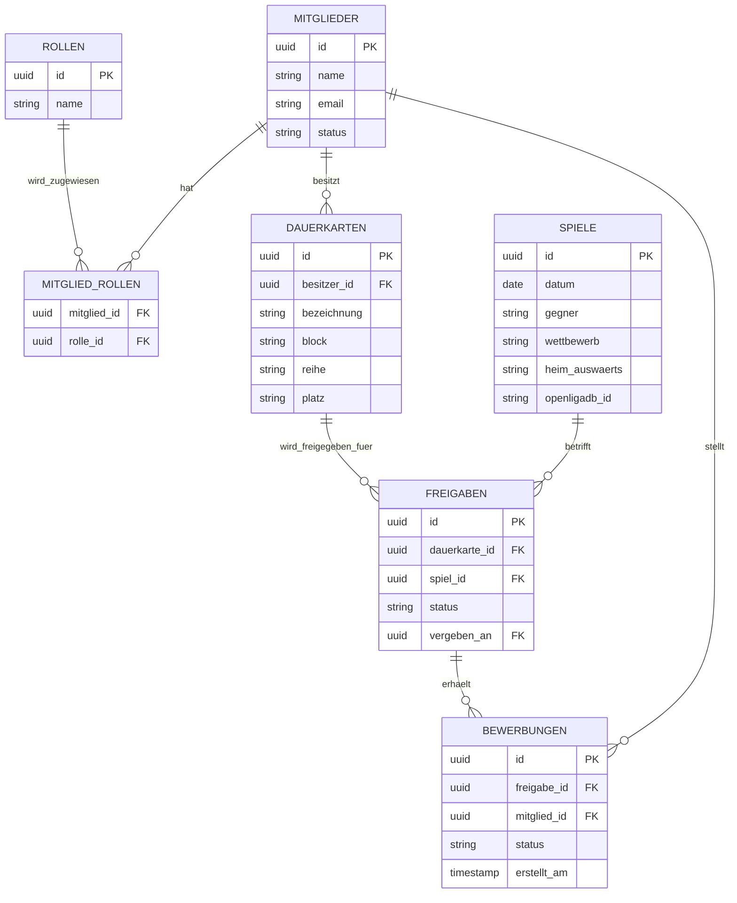

# Seefüchse-App – Projektdokumentation

> Verwaltungstool für Dauerkarten-Freigaben des SC Freiburg Fanclubs „die Seefüchse" – ersetzt die bisherige Excel-Verwaltung.

> Für KI-Coding-Assistenten (z. B. GitHub Copilot): ausführlicher Entwicklungskontext, Architekturentscheidungen, bekannte Workarounds und Coding-Konventionen liegen in [`.github/copilot-instructions.md`](.github/copilot-instructions.md). Dieses README bleibt der kompakte Überblick für Menschen.

## Inhalt

- [Über das Projekt](#über-das-projekt)
- [Kernfunktion](#kernfunktion)
- [Tech-Stack](#tech-stack)
- [Datenbankstruktur](#datenbankstruktur)
- [Rollensystem](#rollensystem)
- [Seiten-Übersicht](#seiten-übersicht)
- [Implementierungsstand](#implementierungsstand)
- [Projektstruktur](#projektstruktur)
- [Spielplan-Synchronisation](#spielplan-synchronisation)
- [Setup / Lokale Entwicklung](#setup--lokale-entwicklung)
- [Git-Konventionen](#git-konventionen)
- [Offene Punkte](#offene-punkte)

## Über das Projekt

Die Seefüchse sind ein Fanclub des SC Freiburg mit Sitz am Bodensee und rund 28 Mitgliedern. Der Club besitzt 12 Dauerkarten und 2 Fanclubkarten, die nicht bei jedem Spiel von allen Besitzern genutzt werden können. Bisher lief die Verwaltung freier Karten über Excel; die Seefüchse-App digitalisiert diesen Prozess vollständig, inklusive Spielplan, Kartenfreigabe und Bewerbung.

## Kernfunktion

Kann ein Dauerkarten-Besitzer ein Spiel nicht besuchen, gibt er seine Karte für dieses Spiel in der App frei. Alle Mitglieder sehen sofort, welche Karten für welches Spiel frei sind, und können sich darauf bewerben. Der Besitzer entscheidet manuell, wem er die Karte gibt – es gibt keine automatische Vergabe nach Reihenfolge oder Losverfahren. Benachrichtigungen laufen ausschließlich in-app, es ist kein E-Mail-Versand vorgesehen.

Ablauf in Kurzform: **Freigabe** durch DK-Besitzer → **Bewerbung** durch Mitglieder → **Entscheidung** durch DK-Besitzer → **Vergabe**.

## Tech-Stack

- Frontend: SvelteKit 5 (mit Runes: `$props`, `$state`, `$effect`)
- Datenbank: PostgreSQL über Supabase, Zugriff via Drizzle ORM
- Hosting: Netlify
- Icons: `@lucide/svelte` (Nachfolger von `lucide-svelte`, welches deprecated wurde)
- Karten: Leaflet.js
- Styling: Custom CSS, mobile-first ab 375px, Desktop begrenzt auf max. 720px
- Schriften: Inter (UI-Text) und JetBrains Mono (Zahlen/Daten)
- Entwicklung: VS Code, GitHub

Supabase wurde gegenüber Neon und MongoDB bevorzugt, weil Auth und Row Level Security bereits eingebaut sind und kein separates Auth-System nötig ist.

## Datenbankstruktur

Das vollständige ER-Diagramm liegt unter `DB-stucture/seefuechse_er_diagramm_V2.html`. Die zentralen Tabellen:



Die `id` von `mitglieder` ist zugleich Foreign Key auf `auth.users.id` (Supabase verwaltet diese Tabelle selbst, daher gibt es bei `mitglieder` kein eigenes Passwort-Feld mehr – das war im ursprünglichen Diagramm noch vorgesehen, wurde aber bewusst entfernt). Die `status`-Felder sind als Postgres-Enums implementiert, nicht als freier Text:

- `mitglieder.status`: `ausstehend` / `aktiv` / `abgelehnt`
- `freigaben.status`: `offen` / `vergeben` / `zurueckgezogen`
- `bewerbungen.status`: `angefragt` / `angenommen` / `abgelehnt`

Die zentralen Tabellen:

- **mitglieder** – Stammdaten der Mitglieder (bei Supabase per FK an `auth.users`, kein eigenes Passwort-Feld); `status` steuert den Freischaltungs-Flow (siehe Rollensystem/Verwaltung)
- **rollen** – verfügbare Rollen (Admin, Vorstand, Mitglied)
- **mitglied_rollen** – Verknüpfungstabelle, da eine Person mehrere Rollen gleichzeitig haben kann
- **dauerkarten** – die 12 Dauerkarten + 2 Fanclubkarten, jeweils einem Besitzer zugeordnet; `bezeichnung` unterscheidet mehrere Karten (z. B. „DK 1", „Fanclubkarte 1")
- **spiele** – Spielplan, inkl. `openligadb_id` für den automatischen Abgleich (aktuell noch nicht automatisiert, siehe Offene Punkte)
- **freigaben** – verknüpft eine Dauerkarte mit einem Spiel sobald sie freigegeben wird; `status` läuft zwischen `offen`, `vergeben` und `zurueckgezogen`
- **bewerbungen** – Bewerbungen von Mitgliedern auf eine Freigabe; `status` läuft zwischen `angefragt`, `angenommen` und `abgelehnt`

Wichtig: Der „DK-Besitzer" ist keine eigene Rolle, sondern ergibt sich aus der Zuordnung in `dauerkarten`.

## Rollensystem

Drei Rollen: Admin, Vorstand, Mitglied. Sie sind many-to-many über `mitglied_rollen` verknüpft, eine Person kann also z. B. gleichzeitig Vorstand und Mitglied sein. Vorstand hat den gleichen Funktionsumfang wie Admin, mit einer Ausnahme: die Seite „Rollen verwalten" ist ausschließlich Admins vorbehalten.

Technisch wird das über eine private Hilfsfunktion `hatVerwaltungsRolle(userId)` geprüft (joint `mitglied_rollen` mit `rollen`, prüft auf `'admin'` oder `'vorstand'`), die sowohl im `load()` einer Seite als auch nochmal in jeder einzelnen Server-Action aufgerufen wird (Defense-in-Depth – die Berechtigung wird nicht nur durch Verstecken von UI-Elementen erzwungen).

Aktuell gibt es noch keine UI zum Zuweisen von Rollen (siehe Offene Punkte) – Rollen-Zuordnungen müssen bislang manuell per Supabase SQL Editor in `mitglied_rollen` eingetragen werden.

## Seiten-Übersicht

Mockups dazu liegen unter `mockups/`.

- **Start** (`/`) – Dashboard mit Begrüßung, offenen Bewerbungen auf die eigene Karte (falls DK-Besitzer), den nächsten 3 Spielen und allen aktuell club-weit freigegebenen Karten
- **Spielplan** (`/spielplan`) – alle Spiele der Saison, Tabs Kommende/Vergangene, Filter nach Liga/Pokal/Europa, zeigt freie Karten je Spiel; jede Spielkachel verlinkt zur Detailseite
- **Spieldetail** (`/spielplan/[id]`) – Übersicht zu einem einzelnen Spiel; besitzt der eingeloggte Nutzer eine eigene Dauerkarte, kann er sie direkt von hier aus freigeben/zurückziehen und Bewerbungen entscheiden (gleiche Funktion wie auf „Meine Dauerkarte", nur pro Spiel statt als Liste)
- **Meine Dauerkarte** (`/karte`) – nur für DK-Besitzer: eigene Dauerkarte je kommendem Spiel freigeben/behalten, Bewerbungen einsehen und vergeben
- **Anfragen** (`/anfragen`) – für Mitglieder ohne eigene Dauerkarte: eigene offene Bewerbungen und Verlauf
- **Verwaltung** (`/verwaltung`) – für Admin/Vorstand: Freischaltung wartender Mitglieder (Status `ausstehend` → `aktiv`/`abgelehnt`); Dauerkarten-Zuordnungs-Übersicht und OpenLigaDB-Sync-Status sind als Mockup vorhanden, technisch aber noch nicht umgesetzt
- **Verwaltung → Rollen verwalten** (`/verwaltung/rollen`) – nur Admin: Rollen den Mitgliedern zuweisen

## Implementierungsstand

| Bereich | Status |
| --- | --- |
| Auth (Login, Registrierung, Freischaltung-Workflow) | ✅ fertig |
| Verwaltung → Mitglieder-Freischaltung | ✅ fertig |
| Start-Dashboard mit echten Daten | ✅ fertig |
| Spielplan (Liste, Tabs, Filter) | ✅ fertig |
| Spieldetail-Seite | ✅ fertig |
| Meine Dauerkarte (Freigeben/Vergeben) | ✅ fertig |
| NavBar (DK-Besitzer-Variante) | ✅ fertig |
| Verwaltung → Rollen verwalten (UI) | 🚧 nur Platzhalter |
| Verwaltung → Dauerkarten-Zuordnung (echte Daten) | 🚧 nur Platzhalter |
| Anfragen-Seite (Mitglieder ohne Dauerkarte) | 🚧 nur Platzhalter |
| NavBar-Variante für Mitglieder ohne Dauerkarte | 📋 noch nicht begonnen |
| OpenLigaDB-Sync (automatisch) | 📋 noch nicht begonnen |
| In-App-Benachrichtigungen | 📋 noch nicht begonnen |
| Dark/Light-Mode-Toggle | 📋 bewusst zurückgestellt |

Details zu offenen Punkten siehe unten, ausführlicher Verlauf inkl. aufgetretener Probleme in `.github/copilot-instructions.md`.

## Projektstruktur

```
SEEFUECHSE/
├── DB-stucture/              # ER-Diagramme (Planungsstand)
├── mockups/                  # Visuelle Mockups der Seiten
├── src/
│   ├── routes/
│   │   ├── +page.svelte        # Start-Dashboard
│   │   ├── login/, registrieren/, logout/, warten/
│   │   ├── spielplan/          # Liste
│   │   │   └── [id]/           # Spieldetail
│   │   ├── karte/              # Meine Dauerkarte (nur DK-Besitzer)
│   │   ├── anfragen/           # noch Platzhalter
│   │   └── verwaltung/
│   │       └── rollen/         # noch Platzhalter
│   ├── lib/
│   │   ├── server/
│   │   │   ├── db/             # Drizzle-Schema (schema.ts) + DB-Client (index.ts)
│   │   │   └── freigaben.ts    # geteilte Freigabe-Geschäftslogik (toggleFreigabe, vergebenAn)
│   │   ├── components/         # Card, Header, MatchCard, NavBar, FreigabeZeile
│   │   └── supabase.ts
│   ├── hooks.server.ts         # Auth-Session + Routen-Schutz
│   ├── app.css                 # Design-Tokens
│   ├── app.html
│   └── app.d.ts
├── static/
├── drizzle.config.ts
├── svelte.config.js
├── vite.config.js
├── package.json
└── .env.example
```

## Spielplan-Synchronisation

Spielplan und Ergebnisse werden automatisch über die OpenLigaDB-API synchronisiert statt per Webscraping, um den Admin-Aufwand gering zu halten. OpenLigaDB deckt Bundesliga, 2. Bundesliga, 3. Liga und DFB-Pokal ab (`bl1`/`bl2`/`bl3`/`dfb`). Die Europa League wird dort nicht abgebildet – dafür ist noch eine manuelle Pflege oder eine separate Lösung nötig (siehe offene Punkte).

## Setup / Lokale Entwicklung

1. Node.js (LTS, mind. v20) muss installiert sein. **Hinweis:** `npm run check` läuft mit Node v24 aktuell nicht sauber durch (Versionsmismatch beim `svelte-kit sync`-Schritt mit `@sveltejs/kit@2.9`) – `npm run dev` ist davon nicht betroffen, für saubere Type-Checks empfiehlt sich aber eine LTS-Version (20 oder 22).
2. `npm install`
3. `.env.example` zu `.env` kopieren und mit den echten Supabase-Zugangsdaten füllen. Sonderzeichen im Passwort der `DATABASE_URL` müssen URL-encodiert sein (z. B. `%` → `%25`, `^` → `%5E`, `)` → `%29`).
4. `npm run dev` startet den Dev-Server unter `http://localhost:5173`.
5. **Im Firmennetz/Geschäftslaptop:** ausgehende Verbindungen zur Supabase-DB (Port 6543/5432 + ICMP) sind ggf. blockiert. Workaround: für alles mit direkter DB-Verbindung (`db:push`, `db:studio`, `npm run dev` mit echten Queries) einen Mobile Hotspot nutzen; reiner Code ohne DB-Zugriff läuft weiterhin im Firmennetz.
6. **Repo-Speicherort:** nicht in einem iCloud-Drive-synchronisierten Ordner (z. B. `~/Desktop`) ablegen – das kann zu korrupten Git-Referenzen führen (siehe `.github/copilot-instructions.md`).
7. Für Testdaten (alle 7 Tabellen befüllt, inkl. einloggbarer Test-Mitglieder) liegt ein SQL-Seed-Skript bereit, das direkt im Supabase SQL Editor ausgeführt werden kann (nicht im Repo, bei Bedarf erneut generieren lassen).

## Git-Konventionen

Commits folgen der Konvention `feat:` / `docs:` / `fix:` / `refactor:` (z. B. `feat: Drizzle-Schema aus ER-Diagramm umgesetzt`).

Größere Implementierungsschritte werden häufig als strukturierter Prompt für GitHub Copilot formuliert und dann in VS Code ausgeführt. Wiederkehrende Konventionen und der Grund für bestimmte Architekturentscheidungen stehen in `.github/copilot-instructions.md`, damit Copilot (und neue Mitwirkende) sie nicht aus dem Code allein erraten müssen.

## Offene Punkte

- **Anfragen-Seite** (für Mitglieder ohne Dauerkarte) ist noch reiner Platzhalter
- **Rollen-Verwaltungs-UI** (`/verwaltung/rollen`) ist noch reiner Platzhalter – Rollen müssen aktuell per SQL Editor zugewiesen werden
- **Dauerkarten-Zuordnung in der Verwaltung** zeigt noch keine echten Daten (nur Platzhaltertext)
- **NavBar-Variante für Mitglieder ohne Dauerkarte** (Tab „Anfragen" statt „Dauerkarte") noch nicht umgesetzt
- **Anstoßzeit fehlt im Schema:** `spiele.datum` ist nur ein `date`-Feld ohne Uhrzeit-Komponente; `MatchCard` zeigt deshalb aktuell keine Uhrzeit an. Müsste ergänzt werden, sobald der OpenLigaDB-Sync (der die Anstoßzeit liefert) oder eine manuelle Pflege kommt
- **OpenLigaDB-Sync** ist noch nicht automatisiert (Spielplan-Daten kommen aktuell nur aus dem Seed-Skript); geplant über Netlify Scheduled Functions + Upsert per `externalId`/`matchID`
- Europa-League-Spiele: manuelle Pflege oder alternative Datenquelle, da OpenLigaDB das nicht abdeckt
- Supabase ggf. self-hosten per Docker auf eigener NAS, um nicht an Free-Tier-Limits gebunden zu sein (Auto-Pause nach 1 Woche Inaktivität, keine automatischen Backups)
- Genauer Einsatzzweck von Leaflet.js noch nicht im Detail festgelegt (z. B. Stadion-Standorte oder Anfahrt zu Auswärtsspielen)
- Technische Umsetzung der In-App-Benachrichtigungen (Supabase Realtime vs. Polling) noch offen
- Teststrategie noch nicht festgelegt (bisher manuelles Durchtesten mit Seed-Daten)
- Mehrfach-Dauerkarten pro Besitzer werden vom Dashboard/Karte-Seite noch nicht vollständig unterstützt (es wird aktuell nur die erste gefundene Dauerkarte einer Person berücksichtigt)